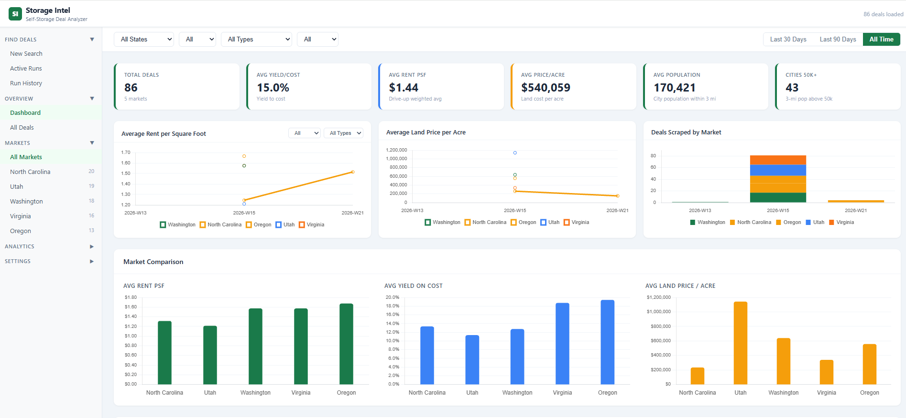
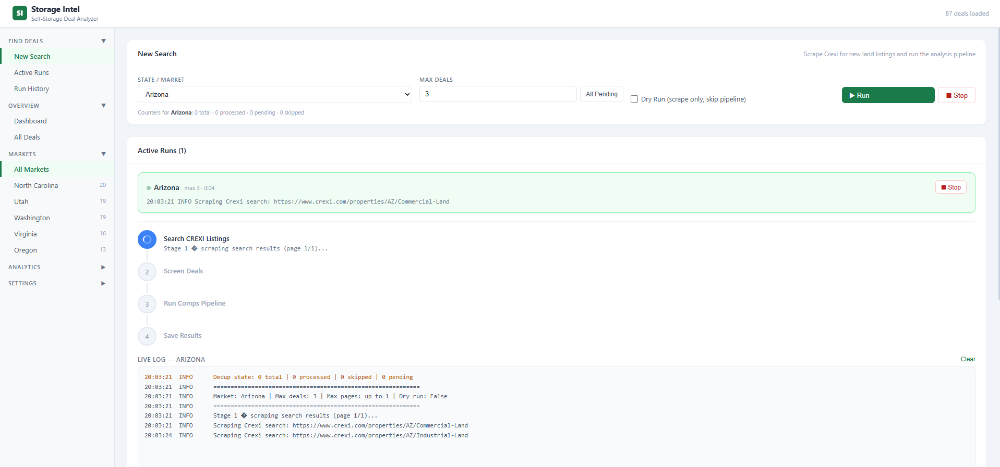
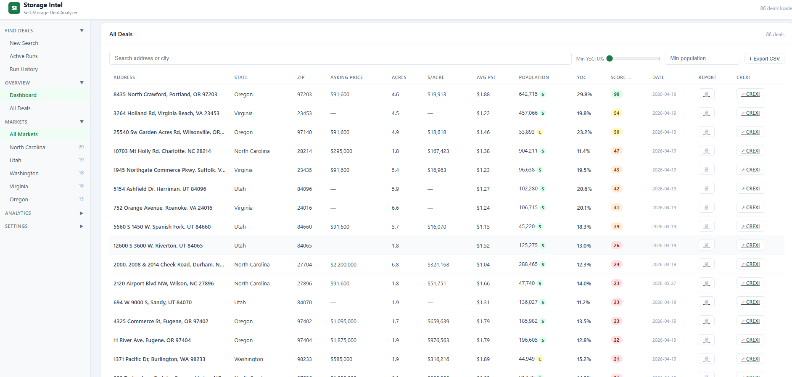
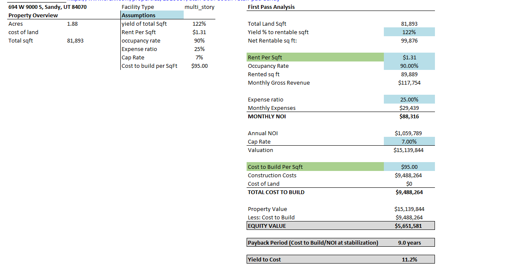
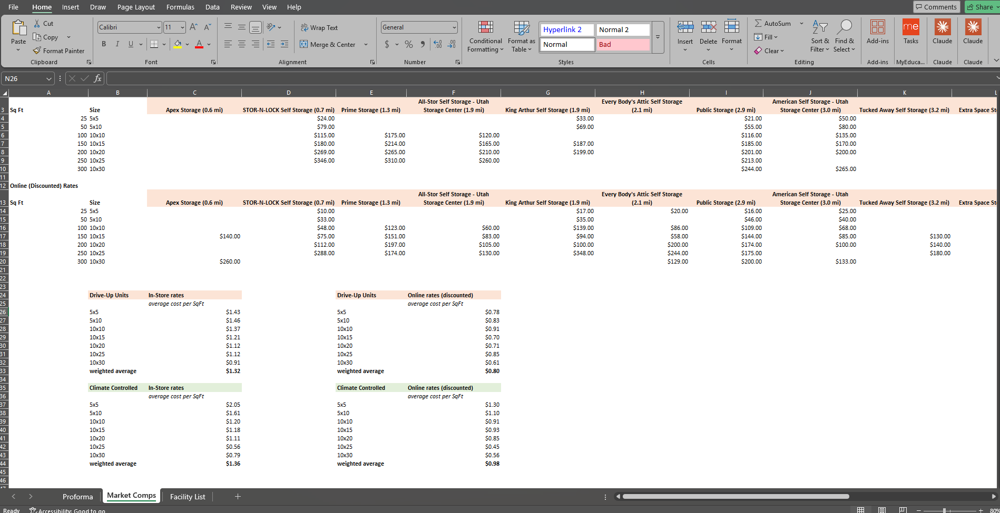

# Self-Storage Analysis Suite

[](https://github.com/Bryant-blip/Self-Storage-Analysis-Suite/actions/workflows/ci.yml)

Tools for finding, underwriting, and tracking self-storage development deals — automated market rent comps, a land-deal watcher, and an analytics dashboard.

## Screenshots



| New search — live pipeline run | All deals — scored & filterable |
|---|---|
|  |  |

| Proforma tab (auto-filled) | Market comps tab |
|---|---|
|  |  |

## What it does

Given a subject address, the core pipeline:

1. **Geocodes** the location (Google Geocoding API)
2. **Discovers** nearby self-storage facilities (Google Places Nearby/Text Search), with hard radius enforcement via Haversine distance and PODS/moving-company exclusion
3. **Scrapes** each facility's own website directly (Firecrawl — handles JS rendering and Cloudflare)
4. **Extracts** structured unit pricing with Claude Haiku (web rate vs. in-store rate, by unit size and climate-controlled vs. drive-up)
5. **Writes** a 3-tab Excel underwriting report: a live-formula proforma, a market comps pricing grid, and a facility list with distances

## Components

- **`comps_pipeline.py`** — the core pipeline described above; also callable as a library from the other tools
- **`storage_comps_agent.py`** — CLI for running the comps pipeline against a single address (`python storage_comps_agent.py "Austin, TX 78701" --radius 5`)
- **`crexi_watcher.py`** / **`crexi_watcher_app.py`** — background agent that polls Crexi for new land listings in a target market, filters them against acreage/population criteria, and automatically runs the full comps pipeline on anything that passes (CLI or Tkinter desktop UI — see `launch_crexi_watcher.bat`)
- **`app.py`** — Flask dashboard over the SQLite deal history (`data/deals.db`): deal counts, average yield-on-cost, $/sqft, and population by market
- **`crexi/`** — Crexi scraping, parsing, deduplication, and Census population-gate modules used by the watcher
- **`scripts/`** — one-off backfill/migration tools (population, land cost, market averages, report regeneration)
- **`tests/`** — pytest suite covering the pure-logic pieces (geometry, facility classification, rent weighting, proforma math, deal scoring) plus an import smoke test; runs in CI on every push (`pytest -q` locally)

## Facility Type Classification

Parcel acreage drives yield, construction cost, and rent assumptions:

| Acreage | Type | Yield | Build cost | Comps used |
|---|---|---|---|---|
| > 4 acres | Single-story | 40% | $50/sqft | Drive-up |
| < 2 acres | Multi-story | 122% | $95/sqft | Climate-controlled |
| 2–4 acres | Mixed | dynamic split, 90k sqft target | — | Both (two mini-proformas) |

Full cell-by-cell proforma logic is documented in [`PROFORMA_LOGIC.md`](PROFORMA_LOGIC.md).

## Setup

```bash
pip install -r requirements.txt
cp .env.example .env          # fill in your API keys
```

Required API keys (see `.env.example` for details):
- `GOOGLE_PLACES_API_KEY` — competitor discovery + geocoding
- `FIRECRAWL_API_KEY` — facility website scraping
- `ANTHROPIC_API_KEY` — pricing extraction
- `CENSUS_API_KEY` *(optional)* — raises rate limits for the population gate
- `CREXI_EMAIL` / `CREXI_PASSWORD` *(optional)* — some Crexi fields are login-gated without them

## Usage

```bash
# One-off comps report for a single address
python storage_comps_agent.py "Austin, TX 78701" --radius 5

# Run the Crexi deal watcher (dry run first to avoid burning API quota)
python crexi_watcher.py --dry-run --max-deals 0
python crexi_watcher.py --max-deals 3

# Analytics dashboard
python app.py   # → http://localhost:5000
```

## Development

```bash
pip install -r requirements-dev.txt   # dev deps (pytest, ruff)
python -m pytest -q                   # run the test suite
python -m ruff check .                # lint
```

## Tech Stack

Python 3.11 · Flask · SQLite (WAL mode) · Google Places/Geocoding API · Firecrawl · Claude Haiku · openpyxl

## Known Limitations

- Facilities with no website listed in Google Places are skipped for pricing (by design — no fabricated data)
- A handful of small/independent operators don't publish pricing online and will show blank cells
- Some chains use dynamic pricing widgets that aren't yet handled by the scraper
